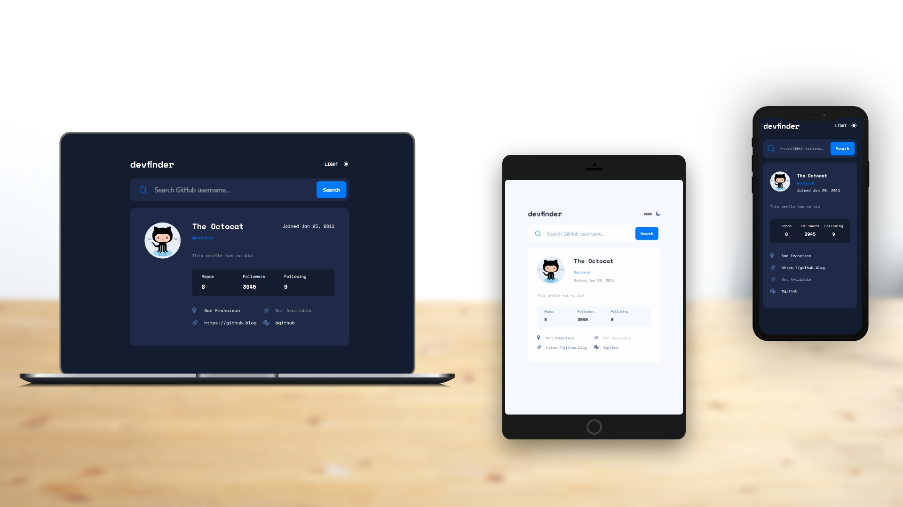

# GitHub user search app

This is a solution to the [GitHub user search app challenge on Frontend Mentor](https://www.frontendmentor.io/challenges/github-user-search-app-Q09YOgaH6). Frontend Mentor challenges help you improve your coding skills by building realistic projects. 

## Table of contents

- [GitHub user search app](#github-user-search-app)
  - [Table of contents](#table-of-contents)
  - [Overview](#overview)
    - [The challenge](#the-challenge)
    - [Screenshot](#screenshot)
    - [Links](#links)
  - [My process](#my-process)
    - [Built with](#built-with)
  - [Author](#author)

**Note: Delete this note and update the table of contents based on what sections you keep.**

## Overview

### The challenge

Users should be able to:

- View the optimal layout for the app depending on their device's screen size
- See hover states for all interactive elements on the page
- Search for GitHub users by their username
- See relevant user information based on their search
- Switch between light and dark themes
- **Bonus**: Have the correct color scheme chosen for them based on their computer preferences. _Hint_: Research `prefers-color-scheme` in CSS.

### Screenshot

### Links

- Live Site URL: [https://benjaminvillatte.github.io/fem-github-user-search-app/](https://benjaminvillatte.github.io/fem-github-user-search-app/)

## My process

### Built with

- Flexbox
- CSS Grid
- Mobile-first workflow
- [Vue.js](https://v3.vuejs.org/) - Vue 3 framework

## Author

- Website - [Benjamin Villatte](https://benjaminvillatte.fr)
